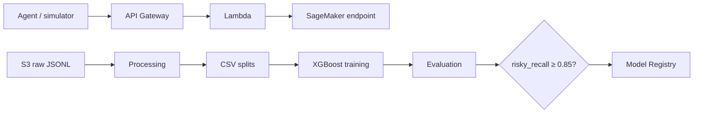

## Overview

AI Coding Agent Risk Scorer evaluates the operational risk of an AI coding-agent execution trajectory. A structured JSON trajectory is turned into 15 model features, classified by XGBoost into six labels, and converted into `allow`, `require_review`, or `block` by a deterministic policy.

{}
The dataset and recorded metrics are synthetic. They demonstrate a working ML/MLOps workflow, not production performance.
{}

> **[IMAGE PLACEHOLDER — overall architecture]** Render the Mermaid diagram in `README.md`, or draw the same components: agent/simulator, API Gateway, Lambda, endpoint, S3, Processing, Training, Evaluation, quality gate, and Registry. Save it as `static/images/2-Proposal/architecture.png`.

## Problem and scope

A final claim such as “tests passed” is not sufficient evidence: an agent may not have run tests, may have modified sensitive files, or may have attempted destructive commands. The system evaluates the full behavioral trajectory: actions, test/lint outcomes, summary support, source, and safety flags.

Implemented scope includes the tool-agnostic JSONL schema; synthetic generator with `safe`, `require_review`, `wrong_tool`, `hallucinated_success`, `risky`, and `failed`; preprocessing and stratified splits; RandomForest and XGBoost; SageMaker Processing, HPO, Pipeline, Registry; endpoint/Lambda/API code; monitoring definitions; and cleanup evidence.

Out of scope are production claims, automatic Registry approval/deployment, a persistent online endpoint, and a default Model Monitor schedule for the nested JSON input.

## Architecture and lifecycle

The pipeline is `agent-risk-scorer-pipeline`: `ProcessTrajectories → TrainXGBoost → EvaluateModel → CheckRiskyRecall → RegisterModel`. It intentionally stops at governed registration; endpoint deployment is a separate, manually controlled operation.

## Data, model, and policy

The v1 schema contains 15 inference features: seven numerical/derived values, six boolean safety/quality signals, and two source indicators. Training uses `XGBClassifier` with `multi:softprob`, plus a `LabelEncoder`. Artifacts are `xgboost_model.json` and `label_encoder.joblib`.

The policy computes a probability-weighted risk score and enforces hard safety overrides: a destructive command always blocks; a sensitive-file touch requires review or blocks. Low/moderate/high score bands map to allow/review/block.

## AWS implementation and evidence

S3 stores raw trajectories, artifacts, reports, and capture data. SageMaker Processing/Training/HPO/Pipelines/Registry implement the governed ML path. Lambda exposes `POST /score-agent-run` through API Gateway, invokes the endpoint, and publishes CloudWatch `RiskScore` and `BlockedDecisions` metrics.

Recorded evidence shows a successful pipeline execution, Registry package versions 1 and 2 in `PendingManualApproval`, and perfect synthetic-split metrics. The short-lived endpoint, Lambda, API Gateway, dashboard, logs, and capture data were deleted on 2026-07-26 to control cost.

> **[IMAGE PLACEHOLDER — HPO and Registry]** Capture the completed HPO job and Registry package version 2 with `PendingManualApproval` in the SageMaker Console. See `plan.md`, steps 5–7.

## Controls and limitations

Credentials remain server-side; `.env` is ignored. Registry approval is manual. The data is rule-generated and easily separable, therefore a score of 1.0 is not real-world generalization. A future production adapter should revalidate safety flags from trusted command/path events rather than relying only on client-provided flags.

The Vietnamese proposal contains the complete implementation detail, commands, and evidence instructions. The Workshop section provides the full execution runbook.
