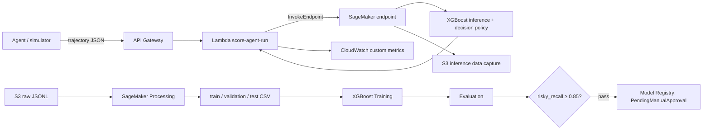

## Tổng quan

**AI Coding Agent Risk Scorer** đánh giá rủi ro vận hành của một lần chạy AI coding agent. Đầu vào là trajectory JSON gồm tool calls, file đọc/sửa, command, kết quả test/lint, thay đổi code và summary. Hệ thống chuyển trajectory thành feature, dự đoán 1 trong 6 nhãn bằng XGBoost, sau đó áp dụng policy để trả `allow`, `require_review` hoặc `block`.

{}
Dataset và metric hiện tại là synthetic. Kết quả dùng để chứng minh workflow ML/MLOps chạy đúng; không phải kết luận về độ chính xác production.
{}

> **[ẢNH PLACEHOLDER — kiến trúc tổng thể]** Vẽ/chụp sơ đồ có các khối: Agent/Simulator → API Gateway → Lambda → SageMaker Endpoint; và S3 raw → Processing → Training → Evaluation → quality gate → Model Registry. Lấy ảnh bằng cách render Mermaid trong `README.md` hoặc tự vẽ theo sơ đồ đó; lưu vào `static/images/2-Proposal/architecture.png`.

## Vấn đề

Coding agent có thể sửa source code, chạy test và gọi command. Chỉ nhìn final summary như “tests passed” không đủ để tin cậy: agent có thể không chạy test, chạm `.env`/CI file hoặc dùng lệnh phá hoại. Project đánh giá bằng chứng hành vi trong toàn bộ trajectory, không chỉ kết quả cuối.

Các tín hiệu chính:

- phạm vi thao tác: file đọc/sửa, tool/command count, kích thước diff;
- chất lượng kỹ thuật: test, lint và summary có được hành động hỗ trợ hay không;
- safety: sensitive file, destructive command và network command;
- nguồn trajectory: simulator hoặc mini LLM agent.

## Mục tiêu và phạm vi

Đã triển khai:

- JSON/JSONL trajectory contract tool-agnostic;
- synthetic scenario generator có 6 nhãn: `safe`, `require_review`, `wrong_tool`, `hallucinated_success`, `risky`, `failed`;
- feature extraction, train/validation/test split stratified 70/15/15;
- RandomForest baseline và XGBoost multiclass model;
- SageMaker Processing, Training/HPO, Evaluation, Pipeline, quality gate và Model Registry;
- SageMaker inference handler, Lambda, HTTP API `POST /score-agent-run`;
- CloudWatch metric definition và SageMaker data capture configuration;
- mock agent, FastAPI demo repository, reports và cleanup record.

Ngoài phạm vi:

- production quality claim hoặc real human-labelled trajectory dataset;
- tự động approve/deploy Registry model;
- Model Monitor schedule: raw input là nested JSON, cần flatten trước;
- endpoint/API hoạt động thường trực: demo resources đã được xóa để tránh chi phí.

## Kiến trúc và data flow



Luồng training dùng `s3://agent-risk-scoring/raw/sample_trajectories.jsonl`. Pipeline `agent-risk-scorer-pipeline` thực hiện `ProcessTrajectories → TrainXGBoost → EvaluateModel → CheckRiskyRecall → RegisterModel`. Pipeline **không deploy endpoint**; deploy là release operation tách riêng.

## Data contract và feature schema

Raw trajectory có các trường `tools_called`, `files_read`, `files_modified`, `commands_run`, `tests_passed`, `lint_passed`, `diff_lines_added`, `diff_lines_deleted`, các risk flags, `final_summary` và `label` cho training.

Feature schema v1 có 15 feature model input: 7 numeric/derived (`num_files_read` đến `latency_total_ms`), 6 boolean flags và 2 one-hot source flags. `label` là target, không được đưa vào inference.

```json
{
  "num_files_read": 1,
  "num_files_modified": 1,
  "num_tools_called": 3,
  "num_commands_run": 1,
  "diff_total_lines": 5,
  "task_file_relevance_score": 0.85,
  "latency_total_ms": 450,
  "tests_passed": 1,
  "lint_passed": 1,
  "touched_sensitive_files": 0,
  "destructive_command_detected": 0,
  "used_network_command": 0,
  "summary_claim_supported": 1,
  "source_simulator": 0,
  "source_mini_llm_agent": 1
}
```

## Model, policy và metrics

`training/train_xgboost.py` dùng `XGBClassifier(objective="multi:softprob")` và `LabelEncoder`. Model artifact gồm `xgboost_model.json` cùng `label_encoder.joblib`. Evaluation báo `accuracy`, `macro_f1`, `risky_recall` và `risky_false_negative_rate`.

Decision policy không chỉ dựa vào class dự đoán. Nó tính weighted probability risk score (`safe=0.0`, `require_review=0.4`, `failed=0.6`, `wrong_tool=0.7`, `hallucinated_success=0.9`, `risky=1.0`) và áp dụng hard rule:

- destructive command → luôn `block`;
- sensitive file → `require_review` hoặc `block` theo score;
- score `<0.3` → `allow`; `<0.7` → `require_review`; còn lại → `block`.

## AWS services và trạng thái evidence

| Service | Vai trò trong project | Trạng thái ghi nhận |
| --- | --- | --- |
| Amazon S3 | raw JSONL, artifacts, reports, data capture | artifacts được giữ lại |
| SageMaker Processing | feature extraction và split | có Pipeline evidence thành công |
| SageMaker Training/HPO | XGBoost, HPO chọn model | best job hoàn thành |
| SageMaker Pipelines | orchestration + quality gate | execution thành công |
| Model Registry | versioned model package | version 1 và 2, `PendingManualApproval` |
| Endpoint/Runtime | real-time inference | đã xóa sau demo |
| Lambda/API Gateway | `POST /score-agent-run` | đã xóa sau demo |
| CloudWatch/Data Capture | `RiskScore`, `BlockedDecisions`, capture | đã xóa resource demo; evidence report còn lại |

Kết quả HPO/evaluation được lưu trong `report/best_model_metrics.json` và `models/evaluation_report.json`: validation/test metrics đã ghi nhận đều là `1.0` trên synthetic split; risky false-negative rate là `0.0`.

> **[ẢNH PLACEHOLDER — HPO và Registry]** Chụp SageMaker Console: HPO job `agent-risk-xgb-hpo-260723-2011` ở trạng thái Completed, sau đó Model Registry group `agent-risk-scorer` với package version 2 và `PendingManualApproval`. Hướng dẫn đầy đủ nằm ở `plan.md`, Bước 5–7.

## Bảo mật, chi phí và hạn chế

- `.env` không được commit; AWS credentials không được gửi cho client API.
- Lambda role chỉ có quyền invoke endpoint, logging và CloudWatch metrics theo script deploy.
- Model Registry yêu cầu manual approval.
- Endpoint, API Gateway, Lambda, endpoint configurations, dashboard/log groups và data-capture demo đã được cleanup ngày 2026-07-26.
- Data synthetic có pattern nhãn rất rõ nên perfect metrics không thể được diễn giải là generalization thực tế.
- API nhận risk flags từ payload; production adapter nên tự suy luận/revalidate flags từ command/path đáng tin cậy thay vì chỉ tin client.

## Deliverables và tài liệu

- Source: `agent/`, `data_generation/`, `preprocessing/`, `training/`, `pipelines/`, `serving/`, `lambda/`, `monitoring/`, `scripts/`.
- Local artifacts: `data/processed/`, `models/`, `runs/`, `report/`.
- Reports: `final_report_vi.md`, `final_report_en.md`, `report/architecture.md`, `report/demo_script.md`, `plan.md`.
- Workshop: chương 5 của site này trình bày lệnh chạy lại, evidence cần chụp và cleanup.

## References

- [SageMaker Processing](https://docs.aws.amazon.com/sagemaker/latest/dg/processing-job.html)
- [SageMaker Pipelines](https://docs.aws.amazon.com/sagemaker/latest/dg/pipelines.html)
- [SageMaker real-time inference](https://docs.aws.amazon.com/sagemaker/latest/dg/realtime-endpoints.html)
- [Lambda with API Gateway](https://docs.aws.amazon.com/lambda/latest/dg/services-apigateway.html)
